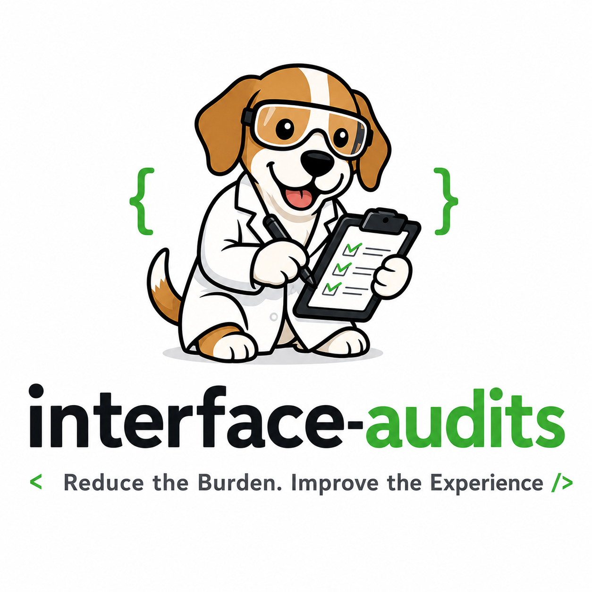

<p align="center">
  <a href="README.ja.md">日本語</a> | <a href="README.zh.md">中文</a> | <a href="README.md">English</a> | <a href="README.fr.md">Français</a> | <a href="README.hi.md">हिन्दी</a> | <a href="README.it.md">Italiano</a> | <a href="README.pt-BR.md">Português (BR)</a>
</p>

<p align="center">
  
</p>

<p align="center">
  <a href="https://github.com/dogfood-lab/interface-audits/actions/workflows/verify.yml"></a>
  <a href="./LICENSE"></a>
  <a href="https://dogfood-lab.github.io/interface-audits/"></a>
  <a href="./SHIP_GATE.md"></a>
</p>

<p align="center"><em>Proof-backed audits for human-facing product surfaces.</em></p>

---

## ¿De qué se trata?

`interface-audits` es una biblioteca de criterios de auditoría y las habilidades ejecutables que los implementan. Cada auditoría detecta una clase específica de fallos que afectan al usuario y que los analizadores de accesibilidad genéricos no detectan. Los analizadores detectan las infracciones de WCAG; estas auditorías detectan interfaces que **superan los analizadores, pero que aún así dificultan la experiencia del usuario**.

La primera auditoría de esta biblioteca es la de **Carga Cognitiva**, que detecta la sobrecarga cognitiva: interfaces que imponen una carga al usuario en términos de memoria, búsqueda, confianza, verificación, navegación, configuración, recuperación de datos, decodificación visual, tiempo, recuperación/deshacer o pérdida de funciones.

Cada auditoría incluye cuatro elementos:

1. **Criterios** — doctrina, secciones, reglas de severidad ([`audits/cognitive-load/RUBRIC.md`](audits/cognitive-load/RUBRIC.md))
2. **Habilidad** — contrato y procedimiento de ejecución ([`audits/cognitive-load/skill/SKILL.md`](audits/cognitive-load/skill/SKILL.md))
3. **Esquema** — Esquema JSON para los resultados y las tarjetas de puntuación ([`shared/schemas/`](shared/schemas/))
4. **Evidencia** — al menos una prueba de estrés completada o una fase de pruebas internas ([`audits/cognitive-load/evidence/`](audits/cognitive-load/evidence/))

Sin evidencia, no hay auditoría oficial. Consulte [`shared/audit-lifecycle.md`](shared/audit-lifecycle.md) para ver el diagrama de estados.

## Instalación

La mayoría de los usuarios no "instalan" este repositorio; lo leen. Las auditorías son criterios y habilidades en formato Markdown que son interpretados por [Claude](https://claude.ai) u otro ejecutor de IA compatible con las herramientas MCP adecuadas (navegación web, captura de pantalla, lectura del DOM).

Para los mantenedores que deseen ejecutar las herramientas de verificación locales (validación de esquemas, verificación de enlaces, auditoría de "shipcheck"):

```bash
git clone https://github.com/dogfood-lab/interface-audits.git
cd interface-audits
npm install        # installs ajv, ajv-formats, glob (dev-only)
npm run verify     # runs schema + link + shipcheck checks
```

**Requisitos:** Node 20+ para las herramientas de verificación. Las propias auditorías son archivos Markdown independientes de la plataforma.

## Uso

### Ejecutar una auditoría

Ejecute a través de Claude (o un ejecutor compatible):

> Ejecute la auditoría de carga cognitiva en `<URL o elemento objetivo>`

Consulte [`audits/cognitive-load/skill/SKILL.md`](audits/cognitive-load/skill/SKILL.md) para ver la lista completa de comandos, entradas, salidas y el procedimiento.

### Lectura de auditorías existentes

Las ejecuciones de auditoría anteriores se encuentran en `audits/<nombre>/evidence/<id_de_ejecución>/` y consisten en tres archivos:

- `<auditoría>-findings.md` — resultados completos en formato de criterios
- `<auditoría>-scorecard.json` — resultado por sección (aprobado/advertencia/fallo) + resumen
- `remediation-priority-list.md` — resultados ordenados por severidad × impacto

Las auditorías actuales y sus correspondientes evidencias se encuentran en la tabla [Auditorías actuales](#current-audits) a continuación.

### Creación de una nueva auditoría

Una nueva auditoría pasa por cinco estados del ciclo de vida: Borrador → Prueba de estrés → Congelada → Pruebas internas → Revisada. Consulte [`shared/audit-lifecycle.md`](shared/audit-lifecycle.md) para ver el diagrama de estados, [`shared/pressure-test-protocol.md`](shared/pressure-test-protocol.md) para el procedimiento y la auditoría de carga cognitiva en `audits/cognitive-load/` como implementación de referencia.

## Superficie de riesgo

Cuando se invoca una habilidad de auditoría, el ejecutor (Claude con las herramientas MCP adecuadas) realiza operaciones sobre el objetivo proporcionado por el usuario:

- **Salida de la red:** Solo se permite la conexión a la URL de destino especificada por el usuario. Los componentes no llaman a otros servicios.
- **Captura del DOM y de capturas de pantalla:** El componente puede leer el DOM de la página, tomar capturas de pantalla e inspeccionar clases CSS responsivas. El contenido capturado puede incluir cualquier elemento visible en la sesión autenticada del usuario en la URL de destino, incluyendo nombres, cuerpos de mensajes y estado de la cuenta.
- **Escritura de archivos locales:** Los archivos de evidencia se escriben únicamente en el directorio `audits/<nombre>/evidence/<id_de_ejecución>/` dentro del árbol de trabajo del repositorio. Los componentes no escriben fuera de este ámbito.
- **No se transmite evidencia hacia el exterior:** Los archivos de evidencia permanecen en el disco local a menos que el usuario los confirme y los suba explícitamente.
- **Sin telemetría, sin manejo de secretos:** Este repositorio no recopila análisis y no lee credenciales.

Antes de confirmar los archivos de evidencia en un repositorio público, el usuario es responsable de revisar lo que se ha capturado. Consulte el archivo [`SECURITY.md`](SECURITY.md) para obtener el modelo de amenazas completo, la política de notificación de vulnerabilidades y el alcance.

## Auditorías actuales

| Auditoría | Estado | Problemas detectados | Evidencia |
|---|---|---|---|
| [cognitive-load](audits/cognitive-load/) | Versión 0.2 (congelada) + Probada internamente una vez | Sobrecarga cognitiva, complejidad oculta, carga de confianza en la IA, fallo en el cambio de estado. | PT0 (claude.ai), PT1 (GitHub), PT2-doc-fallback (Outlook), Dogfood-1 (manual de investigación-os) |

## Familia de auditorías

Cada auditoría debe declarar *¿qué problema detecta esta auditoría que los escáneres genéricos no detectan?* Para la sobrecarga cognitiva, la respuesta es la sobrecarga.

Las futuras auditorías de esta familia podrían incluir: baja visión (acceso visual bajo condiciones de densidad real), tarea de lector de pantalla (continuidad de la tarea, no solo validez de ARIA), dependencia del color, acceso motor, sensibilidad al movimiento y superficie de confianza de la IA. Las auditorías se agregan una a la vez, con evidencia, cuando un objetivo real justifica el trabajo, no por especulación.

## Estructura del repositorio

```
interface-audits/
├── README.md
├── CHANGELOG.md                       # monorepo events
├── SECURITY.md                        # threat surface + reporting
├── SHIP_GATE.md                       # shipcheck quality gate
├── SCORECARD.md                       # pre/post-treatment scores
├── LICENSE                            # MIT
├── package.json                       # verify tooling + Node engines
├── verify.sh                          # one-command verification
├── scripts/
│   ├── verify-schemas.mjs             # JSON Schema validation
│   └── verify-links.mjs               # markdown relative-link check
├── shared/                            # cross-audit norms
│   ├── audit-lifecycle.md
│   ├── evidence-states.md
│   ├── severity-model.md
│   ├── finding-format.md
│   ├── pressure-test-protocol.md
│   └── schemas/
│       ├── finding.base.schema.json
│       └── scorecard.base.schema.json
└── audits/
    └── cognitive-load/                # first audit
        ├── README.md
        ├── RUBRIC.md
        ├── CHANGELOG.md
        ├── skill/SKILL.md
        ├── schemas/finding.extensions.json
        └── evidence/                  # pressure tests + dogfood runs
```

## Lo que esto no es

- No es un escáner de conformidad con WCAG (utilice [axe](https://www.deque.com/axe/), [Lighthouse](https://developer.chrome.com/docs/lighthouse), [Pa11y](https://pa11y.org/) para eso).
- No es una revisión del diseño visual.
- No es una lista de verificación genérica de accesibilidad.
- No es un paquete npm publicado (todavía: el archivo `package.json` declara `private: true` hasta que se cree un paquete de ejecución).

Las auditorías de este repositorio están diseñadas para ejecutarse en interfaces que **pasan los escáneres pero aún hacen que los usuarios tengan dificultades**.

## Contribuciones

Este repositorio es actualmente mantenido por [dogfood-lab](https://github.com/dogfood-lab). Se aceptan contribuciones externas: abra un problema primero para discutir cualquier nueva auditoría o cambio en la rúbrica. Según el ciclo de vida: sin evidencia, no hay auditoría oficial.

## Licencia

[MIT](LICENSE) — Copyright (c) 2026 dogfood-lab.

---

<p align="center">
  <em>Part of <a href="https://github.com/dogfood-lab">dogfood-lab</a> — sister to <a href="https://github.com/mcp-tool-shop-org">mcp-tool-shop-org</a>.</em>
</p>
